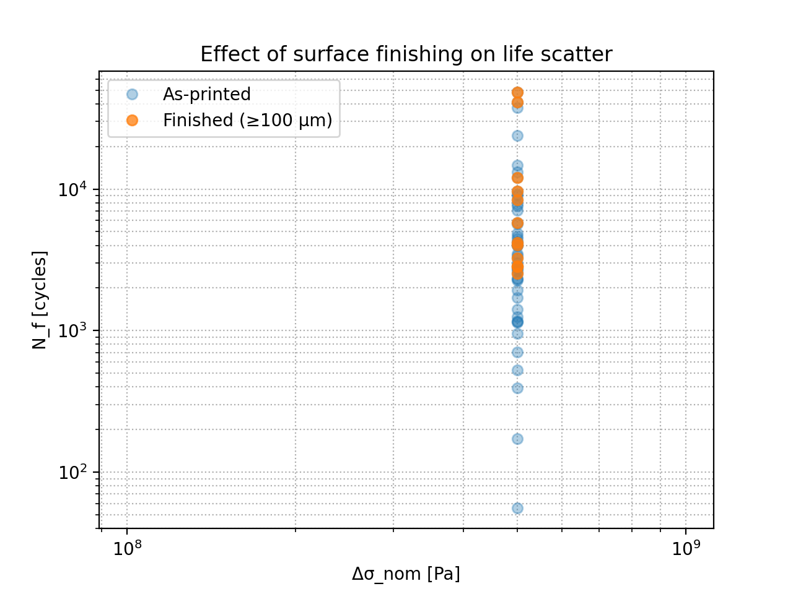

# Virtual Tungsten Fatigue — Defect-Aware Digital Twin (Lite, no lab required)

## Introduction
This mini-project is based on models for structural integrity and the lifetime of EB-PBF tungsten. It builds a digital twin: synthetic defect populations → Kitagawa/Murakami logic → short-crack Paris growth (MPa√m units) → Monte-Carlo life scatter. Outputs include a designer Kitagawa chart, S–N scatter with percentiles, and what-if studies (surface finishing, pore shape, clustering). 

## What to look for
Kitagawa designer chart: allowable Δσ vs. defect √area.

S–N (fixed Δσ): life scatter + median/5–95% markers.

What-ifs:

Surface finishing (remove top 100–300 μm) → life ↑, scatter ↓.

Elongated pores (low AR) → life ↓.

Clustering (size mixture) → more short-life outliers.

Sensitivity: ΔK_th, Paris (C, m), nominal Δσ.

## Scope
Defect → fatigue modelling with thresholded short-crack life and Monte-Carlo scatter.
No physical testing. FE-ready: you can later replace the SCF surrogate with FE hot-spots (Δσ) or ΔK/J fields.

## Method (Lite path)
- Synthetic pores (size, aspect ratio, surface/subsurface, depth)
- Stress concentration proxy, Kitagawa–Takahashi limit
- Short-crack growth (Paris-like) from `a0` to `a_crit`
- Monte Carlo across pore populations

## Results 
Designer chart (Kitagawa):

Baseline S–N with percentiles:

What-ifs (unit-corrected):
| Surface finishing *(remove top 100 µm)* | Pore shape *(round vs. elongated)* | Clustering *(isolated vs. size-mixture)* |
| --- | --- | --- |
|    *Removes near-surface pores → ↑ median life, ↓ scatter.* |    *Elongated (low AR) pores raise Kt → ↓ life, wider scatter.* |    *Clusters increase chance of a critical defect → more short-life outliers.* |

**What-if comparisons** (Δσ_nom fixed; Monte-Carlo across defect populations).

## Key Methods & Equations

### Kitagawa–Takahashi (allowable stress vs. defect size)

Let the equivalent crack length be
$a \approx \frac{\text{area}}{\pi}$
$$\quad\text{with}\quad \text{area} = (\sqrt{\text{area}})^2 $$

For small defects (threshold control),
$$\Delta\sigma_{\text{allow}} \\approx\ \frac{\Delta K_{\text{th}}}{\sqrt{\pi\,a}} \;$$

Transition to a long-crack/strength limit is smoothly blended to form the designer curve.

---

### Initial flaw from pore (Murakami-style mapping)

Map a pore to an initial crack size using
$a_0 \propto \sqrt{\text{area}}$
$$\quad\text{(larger proportionality for surface pores)}$$

---

### Paris short-crack growth (MPa$\sqrt{\text{m}}$ units)

$$ \frac{da}{dN} \=\C\,(\Delta K)^m,\qquad \Delta K \;=\; Y\,\Delta\sigma_{\text{MPa}}\,\sqrt{\pi\,a} \;$$

With a threshold check,
$\Delta K < \Delta K_{\text{th}}$
$$\\Rightarrow\$$
$$N_f \to \infty \$$

Integrate from \(a_0\) to \(a_c\) to obtain the life \(N_f\).

> **Units:** Use $$\(\Delta K\)$$ in MPa$\sqrt{\text{m}}$. Choose $$\(C,m\)$$ consistent with those units (e.g., $$\(C\sim 10^{-12}\$$), \($$m\approx 3\)$$). Convert stresses $$\(\Delta\sigma\)$$ from Pa to MPa when computing $$\(\Delta K\)$$.

---

### Monte-Carlo workflow

Randomise pore $$\(\sqrt{\text{area}}\)$$, aspect ratio, surface proximity, and depth; compute $$\(N_f\)$$ per specimen to get scatter, medians, and percentile bands.

## Future Scope
FE drop-in: Replace SCF with FEniCSx/CalculiX Δσ hot-spots or ΔK/J fields (pipeline already accepts them).

Data-driven pores: Swap synthetic pore stats with XCT-derived distributions.

Load cases: Add mean stress (R-ratio) effects and multiaxial surrogates.

Reliability: Fit parametric life distributions (Weibull/Lognormal) for design allowables.

